```{r setup, include=FALSE}
knitr::opts_chunk$set(echo = TRUE)
```

## BAM File

We use the bam file NA20538.bam, the visualization for this file is by the next command.

***samtools view -H NA20538.bam \| less -S***

**What does RG stand for?**

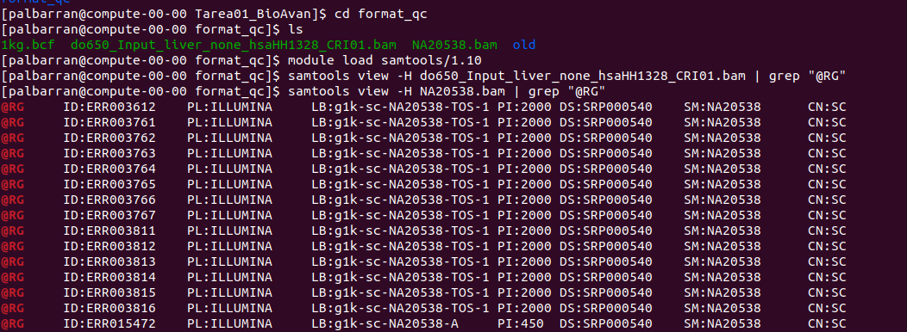

It is an acronym for Read Groups and indicates that the sample was sequenced in different lanes with the aim of correcting biases.

Refers to a set of reads that are generated from a single run of a sequencing instrument.

In the simple case where a single library preparation derived from a single biological sample was run on a single lane of a *flow cell*, all the reads from that lane run belong to the same read group. When multiplexing is involved, then each subset of reads originating from a separate library run on that lane will constitute a separate read group. [1]

**What is the lane ID?**

The lane ID can be found in the @RG header line of the BAM file. The {LANE} indicates the lane of the flow cell and the {SAMPLE_BARCODE} is a sample/library-specific identifier. [1]

**What is the sequencing platform?**

Ilumina

**What version of the human assembly was used to perform the alignments?**

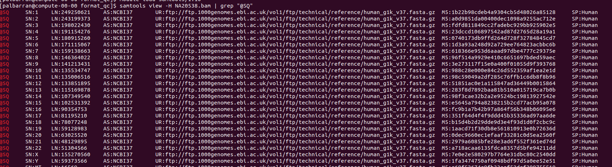

NCBI37

**What programs were used to create this BAM file?**

BWA is used for alignment and samtools to process the BAM.

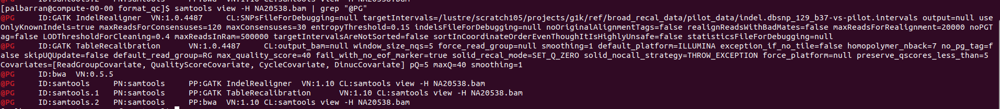

**What version of BWA was used to align the reads?**

BWA version 0.5.5

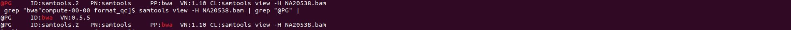

For this questions we use the command

***samtools view NA20538.bam \| head -n 1***

**What is the name of the first read?**

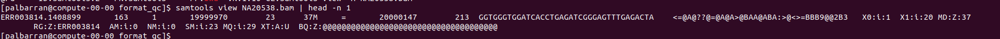

ERR003814.1408899 we obtain for the first column contains the read name.

**What position does the alignment of the read start at?**

19999970, the **4th column** contains the starting position

**What is the mapping quality of the first read?**

23,the **5th column** contains the mapping quality (MAPQ score), in Phred score

## BCF file

**What is a BCF?**

BCF (binary call format) is the binary form of a VCF file, making it lighter and more complex to read.

**Can you convert bcf to vcf using bcftools? How?**

Yes, it is possible to convert a BCF file to VCF using bcftools. To do this, we use the bcftools view command with the -Ov option, which generates the output in uncompressed VCF format, at first glance you can see some variant information

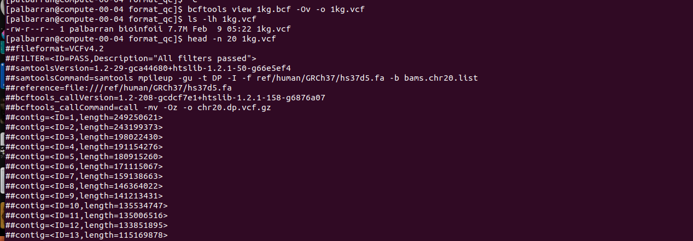

**How many samples are in the BCF?**

-   *Hint: use the -l option.*

50

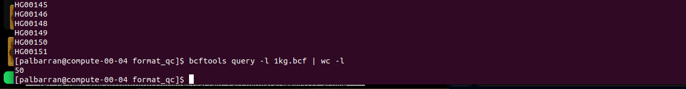

**What is the genotype of the sample HG00107 at the position 20:24019472?**

-   *Hint: use the combination of -r, -s, and -f '[ %TGT]\\n' options.*

Sample HG00107 is heterozygous at position 20:24019472.

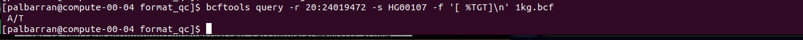

**How many positions there are with more than 10 alternate alleles?**

-   *(See the INFO/AC tag.) Hint: use the -i filtering option.*

778 positions have alternative alleles.

**List all positions where HG00107 has a non-reference genotype and the read depth is bigger than 10.**

9776 are the positions that do not have the reference genotype

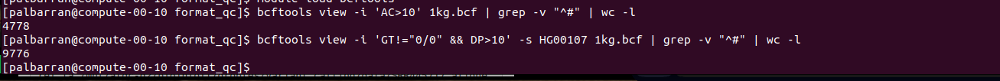

## Stats

**What is the total number of reads?**

Total read are 347,367

**What proportion of the reads were mapped?**

The total number of mapped positions is 323966, so the proportion of mapped positions is 93.23%.

**How many reads were mapped to a different chromosome?**

4055 reads mapped with a different chromosome

**What is the insert size mean and standard deviation?**

• Hint: options -F SECONDARY

The average is 190.3

And the standard deviation is 136.4

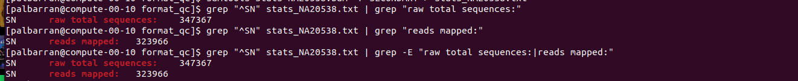

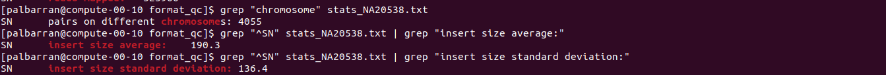

## References

[1] <https://gatk.broadinstitute.org/hc/en-us/articles/360035890671-Read-groups>
